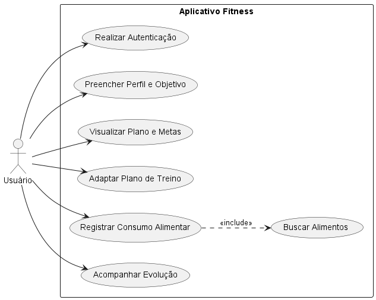

# ⚡ Kalo - App de Fitness e Nutrição


O **Kalo** é um aplicativo mobile premium projetado para revolucionar o acompanhamento de saúde, dietas e treinos. Com uma interface moderna, focada em performance e usabilidade, o app permite aos usuários registrarem suas refeições diárias, acompanharem metas de macronutrientes, visualizarem o progresso de peso corporal e manterem um calendário de frequência de treinos. 

O design do projeto adota a identidade visual **"Azul Elétrico"**, utilizando um tema escuro de alto contraste que transmite foco e tecnologia.

---

## ✨ Funcionalidades (Escopo da 1ª Entrega)

* **🔐 Autenticação e Onboarding:** Telas de entrada (`LoginScreen`) e configuração inicial de perfil com definição de medidas corporais e objetivos (`OnboardingScreen`).
* **📊 Dashboard (Home):** Resumo visual rápido de calorias consumidas, metas de macronutrientes e atalho direto para o treino planejado do dia.
* **🍽️ Plano Diário e Pesquisa:** Fluxo completo para visualizar refeições do dia (Café, Almoço, Jantar), com sistema de busca de alimentos e seleção de gramas (`DiarioScreen` e `PesquisaAlimentosScreen`).
* **👤 Perfil e Evolução:** Área do usuário contendo um gráfico de acompanhamento de peso corporal e um calendário visual detalhando a frequência de treinos (`PerfilScreen`).
* **🧭 Navegação Avançada:** Sistema de abas inferiores (Home Bar) integrado com pilhas de navegação (Stack Navigation) para transições fluidas.

---

## 🚀 Tecnologias Utilizadas

O projeto foi construído utilizando as seguintes ferramentas modernas do ecossistema mobile:

* **Framework Base:** React Native
* **Plataforma/Build:** Expo (SDK 57)
* **Estilização:** NativeWind v4 (Tailwind CSS)
* **Roteamento:** React Navigation v6 (Bottom Tabs & Native Stack)
* **Linguagem:** TypeScript

---

## 🎨 Planejamento Visual e Funcional

A interface foi baseada em protótipos de baixa e alta fidelidade focados em experiência do usuário (UX) e interface (UI) no padrão Dark Mode.

### Protótipo de Alta Fidelidade (Figma)
Clique no botão abaixo para acessar o protótipo interativo do design:

[](https://www.figma.com/proto/TWBbVmefg299gUVtsBPupZ/Kalo?node-id=1-2&p=f&t=S49Xn38qj1lSBEF2-1&scaling=scale-down&content-scaling=fixed&page-id=0%3A1)

### Diagramas e Arquitetura

**Diagrama de Caso de Uso**  
*Interações dos atores (usuário) com as funcionalidades centrais do sistema.*  
 


---

## 💻 Pré-requisitos

Antes de começar, você precisará ter instalado em sua máquina:

* [Node.js](https://nodejs.org/) (Versão LTS recomendada)
* [Git](https://git-scm.com/)
* App **Expo Go** instalado no seu smartphone (opcional, para testes em dispositivo físico).

---

## 🛠️ Instalando e Rodando o Projeto

**1. Clone este repositório e acesse a pasta do projeto:**
```bash
git clone [https://github.com/elias445/Kalo-App.git](https://github.com/elias445/Kalo-App.git)
cd app-kalo
````

**2. Instale as dependências essenciais:**

  

Bash

```
npm install
```

**3. Inicie o servidor de desenvolvimento do Expo (limpando o cache):**

  

Bash

```
npx expo start -c
```

- **Para testar no celular:** Escaneie o QR Code gerado no terminal usando o app Expo Go (Android) ou o aplicativo de Câmera (iOS).
    
      
    
- **Para testar no emulador:** Pressione `a` no terminal para abrir no Android Studio ou `i` para abrir no simulador do iOS.
    
      
    

## 🤝 Equipe de Desenvolvimento

Projeto desenvolvido por:

  

- [Elias Manuel Fonseca Moreira](https://github.com/elias445?utm_source=gemini) - Desenvolvedor
    
      
    
- [João Vitor Farias de Amorim](https://github.com/joaovitor-9?utm_source=gemini) - Desenvolvedor