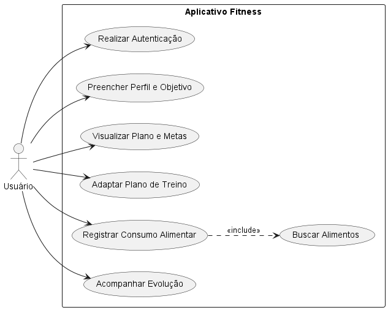

# Kalo - Treino, Dieta e Competição em um só app


O **Kalo** é um aplicativo mobile que reúne em um só lugar o que normalmente exige vários apps de fitness: **plano de treino**, **contador de calorias e macros**, **acompanhamento de evolução** e **competição entre amigos**.

A ideia é que o usuário informe seus dados e seu objetivo, receba um plano personalizado e acompanhe tudo (treinos, alimentação, peso) em uma interface moderna, em tema escuro com a identidade visual "Azul Elétrico". Na aba **Comunidade**, ele pode desafiar amigos e disputar um ranking.


- "devices.json": contains information about devices that have recently opened this project. This is used to populate the "Development sessions" list in your development builds.
- "settings.json": contains the server configuration that is used to serve the application manifest.
- "dev/logs/": contains structured JSONL event logs from CLI commands (e.g. start.log, export.log). These are truncated on each run.

## Funcionalidades

### Conta e onboarding
* **Login e cadastro**, com validação de campos e medidor de força da senha.
* **Onboarding** com dados biométricos (sexo, idade, altura, peso) e escolha do objetivo.
* **Plano gerado** com meta diária de calorias e macronutrientes (equação de Mifflin-St Jeor com fator de atividade e ajuste pelo objetivo) e a divisão semanal de treino.

### Início
* Anel de calorias consumidas x meta, com o quanto ainda resta no dia.
* Macros (carboidratos, proteínas e gorduras) com barras de progresso.
* Prévia do treino do dia, com tempo e gasto estimados, ou aviso de dia de descanso.

### Treino
* **Cronograma semanal** com seletor de dias, divisão do dia e exercícios numerados com séries e repetições.
* **Plano padrão:** treinos de segunda a sexta e descanso no sábado e no domingo.
* **Substituição de exercícios** por recomendados do mesmo grupo muscular, adição de novos exercícios e remoção.
* Tela de treino do dia com checklist e progresso (código pronto, ainda sem ponto de entrada na navegação).

### Dieta
* Seis refeições (café da manhã, lanche da manhã, almoço, lanche da tarde, jantar e ceia) em uma grade única, sem rolagem.
* Resumo do dia com anel de progresso, total consumido e calorias restantes.
* Detalhe de cada refeição, com remoção de alimentos.
* Busca de alimentos com quantidade em gramas, cálculo de kcal da porção e adição direta na refeição escolhida.

### Comunidade
* **Desafio ativo** com progresso em dias e sua posição no ranking.
* **Ranking** com pódio dos três primeiros, lista completa e regras de pontuação.
* **Amigos** e **atividade** (feed com curtidas).
* **Adicionar amigo** por código de convite (compartilhável) ou por @usuário, com sugestões.
* **Novo desafio:** nome, duração, regras de pontuação e participantes.

### Perfil e evolução
* Gráfico de peso corporal em área, com registro de novos pesos.
* Estatísticas rápidas (treinos, média diária e variação de peso).
* Calendário de frequência de treino, com consistência e sequência de dias.
* Edição de perfil (nome, sexo, idade, altura e objetivo).

---

## Tecnologias Utilizadas

* **Framework:** React Native 0.86
* **Plataforma e build:** Expo (SDK 57)
* **Linguagem:** TypeScript
* **Estilização:** NativeWind v4 (Tailwind CSS)
* **Navegação:** React Navigation 7 (Bottom Tabs e Native Stack)
* **Gráficos e ícones:** React Native Gifted Charts, React Native SVG e Lucide React Native
* **Gradientes:** Expo Linear Gradient

---

## Estrutura do Projeto

```text
App.tsx                      # Navegação (stack + abas) e providers
src/
├── components/              # Design system: Screen, Card, HeroCard, botões, campos, TabBar, anel de progresso...
├── context/AppContext.tsx   # Estado global: perfil, peso, refeições, plano de treino, amigos e desafio
├── data/                    # Dados de exemplo e catálogos (treino, alimentos, objetivos, comunidade)
├── screens/                 # Telas do app
├── utils/metas.ts           # Cálculo de calorias e macros
└── theme.ts                 # Tokens de cor, gradientes e sombras
```

---

## Identidade Visual

Tema escuro "Azul Elétrico", com cartões em gradiente, rótulos em caixa-alta e destaques em ciano.

| Token | Cor |
|---|---|
| Fundo | `#07090E` |
| Cartões | `#0E131B` |
| Ciano (destaque) | `#00D1FF` |
| Azul (gradiente) | `#0A5CFF` |
| Texto secundário | `#8B94A7` |

As cores ficam em `tailwind.config.js` e `src/theme.ts`.

---

## Planejamento Visual e Funcional

A interface foi baseada em protótipos de baixa e alta fidelidade focados em experiência do usuário (UX) e interface (UI) no padrão Dark Mode.

### Protótipo (Figma)

[](https://www.figma.com/proto/TWBbVmefg299gUVtsBPupZ/Kalo?node-id=1-2&p=f&t=S49Xn38qj1lSBEF2-1&scaling=scale-down&content-scaling=fixed&page-id=0%3A1)

### Diagrama de Caso de Uso

Interações do usuário com as funcionalidades centrais do sistema.



---

## Pré-requisitos

* [Node.js](https://nodejs.org/) (versão LTS recomendada)
* [Git](https://git-scm.com/)
* App **Expo Go** no celular (opcional, para testar em dispositivo físico) ou um emulador Android/iOS.

---

## Instalando e Rodando o Projeto

**1. Clone o repositório e entre na pasta do projeto:**

```bash
git clone https://github.com/elias445/Kalo-App.git
cd Kalo-App
```

**2. Instale as dependências:**

```bash
npm install
```

**3. Inicie o servidor de desenvolvimento (limpando o cache):**

```bash
npx expo start -c
```

* **No celular:** escaneie o QR Code com o app Expo Go (Android) ou com a câmera (iOS).
* **No emulador:** pressione `a` no terminal para o Android ou `i` para o simulador do iOS.

**Login de teste:** use o e-mail `teste` e a senha `123`, ou crie uma conta pela tela de cadastro.

---

## Próximos Passos

* Backend com autenticação, amigos, desafios e cálculo do ranking.
* Pontuação automática da comunidade a partir dos treinos concluídos e das metas de calorias.
* Base de alimentos real em português (por exemplo, a TACO) com macros por alimento.
* Catálogo de exercícios com imagens e instruções.
* Persistência dos dados do usuário e notificações.
* Atualizar o diagrama de casos de uso com a aba Comunidade.

---

## Equipe de Desenvolvimento

* [Elias Manuel Fonseca Moreira](https://github.com/elias445) - Desenvolvedor
* [João Vitor Farias de Amorim](https://github.com/joaovitor-9) - Desenvolvedor
